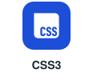
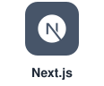
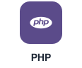
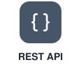
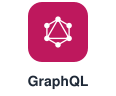
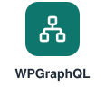
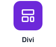
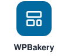
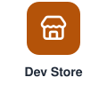

<h1 align="center">Naimur Rahman Nahid - WordPress Developer</h1>

  <a href="https://naimurrahmannahid.com">
    <picture>
      <source media="(prefers-color-scheme: dark)" srcset="https://readme-typing-svg.demolab.com?font=Inter&weight=700&size=26&duration=3000&pause=900&color=A78BFA&center=true&vCenter=true&width=720&height=48&lines=WordPress+%26+WooCommerce+Developer;Custom+Plugin+Author+on+WordPress.org;Headless+WordPress+%2B+Next.js+Builder;SaaS+%26+Dashboard+Developer;Performance+%26+Technical+SEO">
      
    </picture>
  </a>

  <b>I turn WordPress into whatever the business actually needs.</b> 
  Custom plugins, WooCommerce workflows, headless Next.js frontends and SaaS dashboards, 
  built to be fast, secure and easy to maintain.

  
  
  
  

  
  
  

  <a href="https://naimurrahmannahid.com"><b>Portfolio</b></a> &nbsp;&nbsp;|&nbsp;&nbsp;
  <a href="https://profiles.wordpress.org/naimurrahmannahid/"><b>WordPress.org</b></a> &nbsp;&nbsp;|&nbsp;&nbsp;
  <a href="https://www.naimurdevstore.com/"><b>Naimur Dev Store</b></a> &nbsp;&nbsp;|&nbsp;&nbsp;
  <a href="https://linkedin.com/in/naimurrahmannahid"><b>LinkedIn</b></a> &nbsp;&nbsp;|&nbsp;&nbsp;
  <a href="mailto:support@naimurrahmannahid.com"><b>Email</b></a>

 

##  The Short Version

I am **Naimur Rahman Nahid**, a **WordPress developer and full-stack web developer** from **Dhaka, Bangladesh**.

I started building for clients in **November 2021**. <!--YEARS-->4<!--/YEARS-->+ years and **300+ projects** later, across **10+ countries**, I have learned one thing: most businesses do not need another theme or another plugin stack. They need something that fits the way they actually work. That is what I build, through Fiverr, Upwork, Kwork and direct partnerships.

When I am not building for clients, I am shipping my own products. Three of my plugins are live on WordPress.org, and more live at **[Naimur Dev Store](https://www.naimurdevstore.com/)**.

 

##  GitHub Activity

<i>Code does not lie. This is what the work looks like, updated automatically.</i>

  <picture>
    <source media="(prefers-color-scheme: dark)" srcset="https://github-readme-stats.vercel.app/api?username=Naimurrahmannahid&show_icons=true&include_all_commits=true&count_private=true&rank_icon=github&bg_color=0D1117&title_color=A78BFA&text_color=E6EDF3&icon_color=60A5FA&ring_color=A78BFA&border_color=30363D&border_radius=10">
    
  </picture>
  <picture>
    <source media="(prefers-color-scheme: dark)" srcset="https://github-readme-stats.vercel.app/api/top-langs?username=Naimurrahmannahid&layout=compact&langs_count=6&bg_color=0D1117&title_color=A78BFA&text_color=E6EDF3&border_color=30363D&border_radius=10">
    
  </picture>

  <picture>
    <source media="(prefers-color-scheme: dark)" srcset="https://streak-stats.demolab.com?user=Naimurrahmannahid&background=0D1117&border=30363D&stroke=30363D&ring=A78BFA&fire=60A5FA&currStreakNum=E6EDF3&sideNums=E6EDF3&currStreakLabel=A78BFA&sideLabels=C9D1D9&dates=8B949E&border_radius=10">
    
  </picture>

  <picture>
    <source media="(prefers-color-scheme: dark)" srcset="https://github-readme-activity-graph.vercel.app/graph?username=Naimurrahmannahid&bg_color=0D1117&color=E6EDF3&title_color=A78BFA&line=A78BFA&point=60A5FA&area=true&area_color=A78BFA&hide_border=true">
    
  </picture>

  <picture>
    <source media="(prefers-color-scheme: dark)" srcset="https://raw.githubusercontent.com/Naimurrahmannahid/Naimurrahmannahid/output/github-contribution-grid-snake-dark.svg">
    
  </picture>

 

##  By the Numbers

<table align="center">
  <tr>
    <td align="center" width="25%">
      
      <h1><!--YEARS-->4<!--/YEARS-->+</h1>
      <b>Years building</b> since Nov 2021
    </td>
    <td align="center" width="25%">
      
      <h1>300+</h1>
      <b>Projects</b> delivered
    </td>
    <td align="center" width="25%">
      
      <h1>10+</h1>
      <b>Countries</b> with clients
    </td>
    <td align="center" width="25%">
      
      <h1>3</h1>
      <b>Plugins</b> on WordPress.org
    </td>
  </tr>
</table>

 

##  What I Build

<table>
  <tr>
    <td width="50%" valign="top">
      
      <h3>WordPress Engineering</h3>
      <b>For:</b> sites that need to do more than show pages  
      Custom themes, plugins, hooks and filters, admin tools and third-party integrations.
    </td>
    <td width="50%" valign="top">
      
      <h3>WooCommerce Development</h3>
      <b>For:</b> stores that need to fit the business  
      Custom checkout, My Account, order and payment flows, digital products and business rules.
    </td>
  </tr>
  <tr>
    <td width="50%" valign="top">
      
      <h3>Custom Plugin Development</h3>
      <b>For:</b> features no plugin does quite right  
      Production-ready plugins built to WordPress.org standards and easy to maintain.
    </td>
    <td width="50%" valign="top">
      
      <h3>Headless WordPress</h3>
      <b>For:</b> frontends that should feel like an app  
      WordPress or WooCommerce backend, Next.js frontend, WPGraphQL and REST APIs.
    </td>
  </tr>
  <tr>
    <td width="50%" valign="top">
      
      <h3>SaaS & Custom Platforms</h3>
      <b>For:</b> tools that run the business  
      Dashboards, licensing and API-key systems, booking systems and internal tools.
    </td>
    <td width="50%" valign="top">
      
      <h3>Performance & Technical SEO</h3>
      <b>For:</b> sites that should load fast and rank better  
      Core Web Vitals, speed optimization, clean markup and on-page technical SEO.
    </td>
  </tr>
</table>

 

##  Plugins Already Running on Real Stores

These are not demos. They are free, public and listed on the official WordPress.org directory.
 
**[See all my plugins on WordPress.org](https://profiles.wordpress.org/naimurrahmannahid/)**

<table>
  <tr>
    <td>
      <h3>Naimur Email OTP Verification for WooCommerce</h3>
      <code>WordPress</code> <code>WooCommerce</code> <code>PHP</code> <code>Authentication</code>
        
      <b>The problem:</b> fake and mistyped email addresses at signup. 
      <b>The fix:</b> customers confirm their email with a one-time password before an account is created. Includes custom email templates, Google reCAPTCHA and Cloudflare Turnstile support, activity logs and a responsive OTP modal.
        
      
    </td>
  </tr>
  <tr>
    <td>
      <h3>Naimur Courier Ratio Checker</h3>
      <code>WordPress</code> <code>WooCommerce</code> <code>PHP</code> <code>API Integration</code>
        
      <b>The problem:</b> Cash on Delivery orders that never get accepted, a costly issue for Bangladeshi eCommerce. 
      <b>The fix:</b> checks a buyer's courier delivery history by phone number, shows success rates and order-level risk alerts, and can hide Cash on Delivery for high-risk buyers automatically.
        
      
    </td>
  </tr>
  <tr>
    <td>
      <h3>Naimur Edit My Account Page for WooCommerce</h3>
      <code>WordPress</code> <code>WooCommerce</code> <code>PHP</code> <code>UI/UX</code>
        
      <b>The problem:</b> the default WooCommerce My Account page looks dated. 
      <b>The fix:</b> a modern card-based dashboard with a gradient sidebar and icon navigation, responsive on every device.
        
      
    </td>
  </tr>
</table>

 

##  Beyond the Plugins: My Own Products

<table>
  <tr>
    <td width="50%" valign="top">
      <h3>Naimur Dev Store</h3>
      <code>Digital Products</code> <code>Plugins</code> <code>Themes</code>
        
      Where my plugins, themes and developer tools are sold and supported.
        
      
    </td>
    <td width="50%" valign="top">
      <h3>License & API Key Panel</h3>
      <code>SaaS</code> <code>Licensing</code> <code>API</code>
        
      Every paid product needs a way to issue, validate and manage licenses. I built my own SaaS panel for it.
    </td>
  </tr>
</table>

<!--
  Selected GitHub repositories:
  Add 2-4 of your strongest public repositories here, as another table row in the same card style.
-->

 

##  When WordPress Alone Is Not Enough

Page builders are great until the project outgrows them. That is where most of my interesting work happens:

| Layer | What I work with |
|---|---|
| **Architecture** | Headless WordPress / WooCommerce backend with a Next.js frontend |
| **Data** | WPGraphQL and the WordPress REST API |
| **Accounts** | Custom login, account and session flows |
| **Sync** | Webhooks and on-demand revalidation so updates go live instantly |
| **Commerce** | Payment, order and digital product delivery workflows |
| **Apps** | Dashboards and SaaS apps, including Supabase-backed tools |
| **Integrations** | Courier services, email delivery, CAPTCHA, payment gateways |

 

##  How I Keep Code Clean

| Practice | In detail |
|---|---|
| **Standards** | Written against the WordPress Coding Standards |
| **Security** | Nonces, capability checks, sanitized input, escaped output |
| **i18n** | Translation-ready with proper text domains |
| **Settings** | Stored through WordPress APIs, never hardcoded |
| **Performance** | Scripts and styles loaded only on the pages that need them |
| **Maintainability** | Readable, documented code the next developer will not curse at |

 

##  From Brief to Launch

| Step | What happens |
|:---:|---|
| **1. Understand** | Your goals, your current setup, your constraints |
| **2. Plan** | Architecture, scope, timeline and deliverables agreed up front |
| **3. Build** | Staged development with regular progress updates |
| **4. Test** | Functional, responsive and cross-browser checks |
| **5. Launch** | Deployment, configuration and handover notes |
| **6. Support** | 1 month of free post-launch fixes on client projects, maintenance after that if you need it |

 

##  My Toolbox

<b>Frontend</b> 
  <picture><source media="(prefers-color-scheme: dark)" srcset="https://raw.githubusercontent.com/Naimurrahmannahid/Naimurrahmannahid/main/assets/stack/html5-dark.svg"></picture>
  <picture><source media="(prefers-color-scheme: dark)" srcset="https://raw.githubusercontent.com/Naimurrahmannahid/Naimurrahmannahid/main/assets/stack/css3-dark.svg"></picture>
  <picture><source media="(prefers-color-scheme: dark)" srcset="https://raw.githubusercontent.com/Naimurrahmannahid/Naimurrahmannahid/main/assets/stack/javascript-dark.svg"></picture>
  <picture><source media="(prefers-color-scheme: dark)" srcset="https://raw.githubusercontent.com/Naimurrahmannahid/Naimurrahmannahid/main/assets/stack/next-js-dark.svg"></picture>
  <picture><source media="(prefers-color-scheme: dark)" srcset="https://raw.githubusercontent.com/Naimurrahmannahid/Naimurrahmannahid/main/assets/stack/tailwind-dark.svg"></picture>

<b>Backend & APIs</b> 
  <picture><source media="(prefers-color-scheme: dark)" srcset="https://raw.githubusercontent.com/Naimurrahmannahid/Naimurrahmannahid/main/assets/stack/php-dark.svg"></picture>
  <picture><source media="(prefers-color-scheme: dark)" srcset="https://raw.githubusercontent.com/Naimurrahmannahid/Naimurrahmannahid/main/assets/stack/wordpress-dark.svg"></picture>
  <picture><source media="(prefers-color-scheme: dark)" srcset="https://raw.githubusercontent.com/Naimurrahmannahid/Naimurrahmannahid/main/assets/stack/woocommerce-dark.svg"></picture>
  <picture><source media="(prefers-color-scheme: dark)" srcset="https://raw.githubusercontent.com/Naimurrahmannahid/Naimurrahmannahid/main/assets/stack/rest-api-dark.svg"></picture>
  <picture><source media="(prefers-color-scheme: dark)" srcset="https://raw.githubusercontent.com/Naimurrahmannahid/Naimurrahmannahid/main/assets/stack/graphql-dark.svg"></picture>
  <picture><source media="(prefers-color-scheme: dark)" srcset="https://raw.githubusercontent.com/Naimurrahmannahid/Naimurrahmannahid/main/assets/stack/wpgraphql-dark.svg"></picture>

<b>Platforms & Data</b> 
  <picture><source media="(prefers-color-scheme: dark)" srcset="https://raw.githubusercontent.com/Naimurrahmannahid/Naimurrahmannahid/main/assets/stack/supabase-dark.svg"></picture>
  <picture><source media="(prefers-color-scheme: dark)" srcset="https://raw.githubusercontent.com/Naimurrahmannahid/Naimurrahmannahid/main/assets/stack/shopify-dark.svg"></picture>
  <picture><source media="(prefers-color-scheme: dark)" srcset="https://raw.githubusercontent.com/Naimurrahmannahid/Naimurrahmannahid/main/assets/stack/git-dark.svg"></picture>
  <picture><source media="(prefers-color-scheme: dark)" srcset="https://raw.githubusercontent.com/Naimurrahmannahid/Naimurrahmannahid/main/assets/stack/github-dark.svg"></picture>

<b>WordPress Builders</b> 
  <picture><source media="(prefers-color-scheme: dark)" srcset="https://raw.githubusercontent.com/Naimurrahmannahid/Naimurrahmannahid/main/assets/stack/elementor-dark.svg"></picture>
  <picture><source media="(prefers-color-scheme: dark)" srcset="https://raw.githubusercontent.com/Naimurrahmannahid/Naimurrahmannahid/main/assets/stack/divi-dark.svg"></picture>
  <picture><source media="(prefers-color-scheme: dark)" srcset="https://raw.githubusercontent.com/Naimurrahmannahid/Naimurrahmannahid/main/assets/stack/wpbakery-dark.svg"></picture>

 

##  Why Clients Come Back

<table>
  <tr>
    <td width="50%"><b>Built for production</b> Not just for the demo.</td>
    <td width="50%"><b>One focused solution</b> Instead of five plugins fighting each other.</td>
  </tr>
  <tr>
    <td width="50%"><b>Speed is part of the plan</b> Not an afterthought.</td>
    <td width="50%"><b>Clear communication</b> You always know where the project stands.</td>
  </tr>
  <tr>
    <td colspan="2" align="center"><b>I do not disappear after launch</b> Post-launch support is part of every client project.</td>
  </tr>
</table>

 

##  Right Now I Am Working On

- New WordPress and WooCommerce plugins
- Growing Naimur Dev Store and its licensing infrastructure
- Headless WordPress builds with Next.js
- SaaS products and custom dashboards

 

##  Let's Talk

  <a href="mailto:support@naimurrahmannahid.com"><picture><source media="(prefers-color-scheme: dark)" srcset="https://raw.githubusercontent.com/Naimurrahmannahid/Naimurrahmannahid/main/assets/links/email-dark.svg"></picture></a>
  <a href="https://naimurrahmannahid.com"><picture><source media="(prefers-color-scheme: dark)" srcset="https://raw.githubusercontent.com/Naimurrahmannahid/Naimurrahmannahid/main/assets/links/portfolio-dark.svg"></picture></a>
  <a href="https://www.naimurdevstore.com/"><picture><source media="(prefers-color-scheme: dark)" srcset="https://raw.githubusercontent.com/Naimurrahmannahid/Naimurrahmannahid/main/assets/links/store-dark.svg"></picture></a>
  <a href="https://profiles.wordpress.org/naimurrahmannahid/"><picture><source media="(prefers-color-scheme: dark)" srcset="https://raw.githubusercontent.com/Naimurrahmannahid/Naimurrahmannahid/main/assets/links/wordpress-dark.svg"></picture></a>
  <a href="https://linkedin.com/in/naimurrahmannahid"><picture><source media="(prefers-color-scheme: dark)" srcset="https://raw.githubusercontent.com/Naimurrahmannahid/Naimurrahmannahid/main/assets/links/linkedin-dark.svg"></picture></a>
  <a href="https://www.fiverr.com/wordpressnaimur"><picture><source media="(prefers-color-scheme: dark)" srcset="https://raw.githubusercontent.com/Naimurrahmannahid/Naimurrahmannahid/main/assets/links/fiverr-dark.svg"></picture></a>
  <a href="https://www.upwork.com/freelancers/~01f469b3013785c827"><picture><source media="(prefers-color-scheme: dark)" srcset="https://raw.githubusercontent.com/Naimurrahmannahid/Naimurrahmannahid/main/assets/links/upwork-dark.svg"></picture></a>

support@naimurrahmannahid.com &nbsp;|&nbsp; Dhaka, Bangladesh &nbsp;|&nbsp; GMT+6

 

  

<h2 align="center">Have a project that needs more than a template?</h2>

  Tell me what you are trying to build. I will tell you honestly how I would build it, 
  how long it would take, and whether you even need custom code at all.

  
  
  

